#
WeCenter V3.0
###
后台管理手册

####一 首页

####二 全局设置
1. **站点信息**
2. **注册访问**
3. **站点功能**
4. **内容设置**
5. **威望积分**
6. **用户权限**
7. **邮件设置**
8. **开放平台**
9. **性能优化**
10. **界面设置**
 

####三 内容管理
1. **问题管理**
2. **文章管理**
3. **话题管理**

####四 用户管理
1. **用户列表**
2. **用户组**
3. **批量邀请**
4. **职位设置**

####五 审核管理
1. **内容审核**
2. **认证审核**
3. **注册审核**
4. **用户举报**

####六 内容设置
1. **导航设置**
2. **分类管理**
3. **专题管理**
4. **页面管理**

####七 微信微博
1. **微信多帐号管理**
2. **微信菜单管理**
3. **微信自定义回复**
4. **微信第三方接入**
5. **微信二维码管理**
6. **微信消息群发**
7. **微博消息接受**
8. **邮件导入**

####八 邮件群发
1. **任务管理**
2. **用户群管理**

####九 工具
1. **系统维护**

###一. 首页
网站管理员从网站右上角个人用户头像处登录后台管理中心(下面简称后台)。

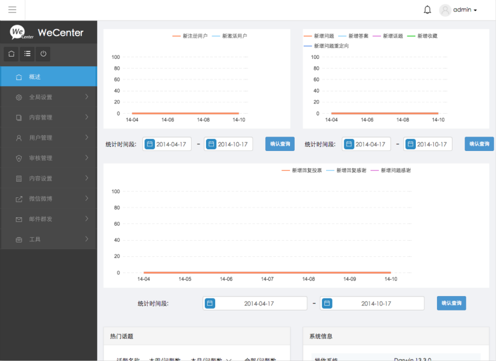

登录后台首页默认显示的就是概述页面，后台顶部导航栏右侧显示后台管理的消息通知以及管理员的头像等，左侧的按钮可以点击隐藏或显示后台页面的左侧导航。后台内容区采用左右布局，左侧显示的后台的功能分类导航，右侧展示每个功能分类下的具体内容。目前后台主要功能有几大类：概述、全局设置、内容管理、用户管理、审核管理、内容设置、微信微博、右键群发、工具。

概述页面也就是后台默认的首页显示的内容包括：网站的用户数，问题数，回复数以及热门话题，系统信息和用户数据。前三者通过统计表的形式展示，还可以自己通过表下面的日历选择查看某个时间段的数据，后三个则通过表格的形式展示。

###二. 全局设置
全局设置包括以下内容功能设：站点信息、注册访问、站点功能、内容设置、威望积分、用户权限、邮件设置、开放平台、性能优化、界面设置。

####1. 站点信息

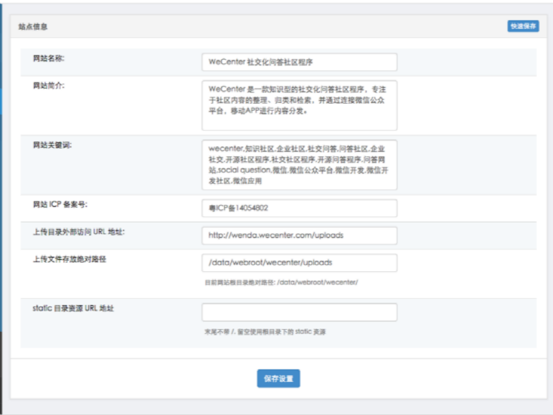

**网站名称**：填写网站的名字，显示在浏览器标题栏的地方。

**网站加简介**：填写你网站的描述，显示网站网站名称后面。

**网站关键词**：填写你网站相关的关键词，用于搜索引擎优化，不会在网站前台显示。

**网站ICP备案号**：填写你网站在工信部的备案号，显示在网站的底部。

**上传目录外部访问地址**：即网站用户上传的话题图片、问题附件等存放地址，可设置独立域名，起到分摊流量作用，独立域名需要绑定到 uploads 目录，无特殊需要可不修改。

**上传文件存放绝对路径**：即上传文件存放到服务器的绝对地址，用户可根据需要存放到服务器群的其它位置，或服务器群的其它机器中，无特殊需要可不修改。

**static 目录资源 URL 地址**：即网站静态资源 css、js 等的访问地址，可设置单独域名，配置cdn加速，起到分摊流量作用，独立域名需要绑定到 static 目录。

####2. 注册访问

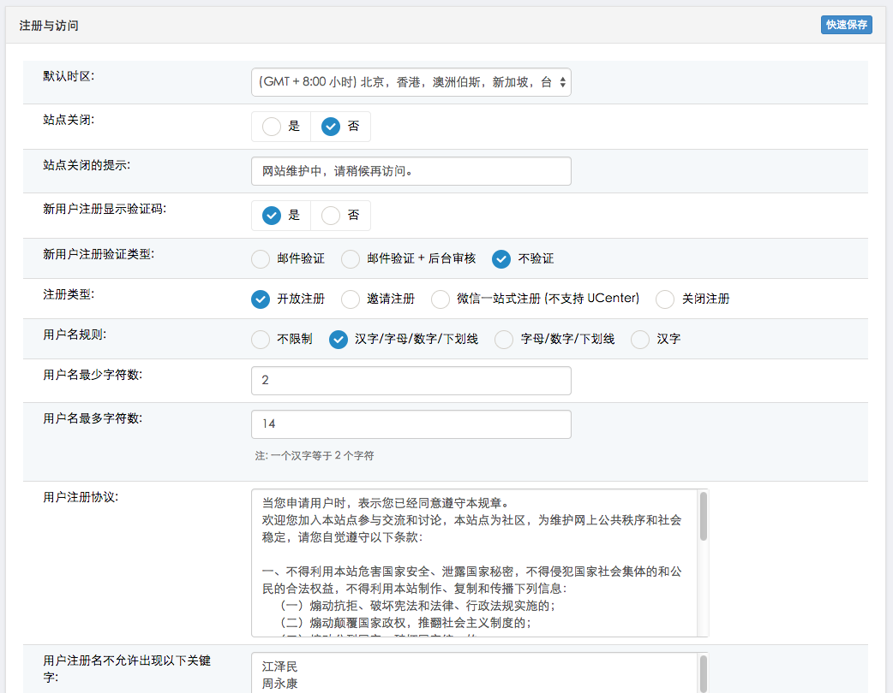

**默认时区**：默认的时间格式设置，允许用户在用户界面自定义，方便不同时区用户对时间概念自定义调整。

**站点关闭**：“是”，表示普通用户将无法访问网站，管理员做系统维护或者升级时候可以临时关闭网站并提示关闭原因。
“否”，默认值，网站可访问。

**站点关闭的提示**：当站点关闭时，显示在网页上面的提醒。

**新用注册显示验证码**：“是“表示新用户注册时显示图形验证码，”否”表示不显示验证码，可用于防止恶意注册的用户。

**新用户注册验证类型**：一般用户注册后要验证才算真正的注册用户，可以选择“邮件验证“，”邮件+后台验证”，也可以“不验证“。

**注册类型**：“开放注册”表示用户可以直接注册，“邀请注册”表示用户只能通过已注册用户的邀请链接来注册，“关闭注册”表示网站目前任何人都不可以注册。

**用户名规则**：WeCenetr 提供四个规则选择，选择某个规则后，用户注册时填写的用户名必须要符合这个规则，否则不能通过注册。可以选择“不限制”、“汉字/字母/数字/下划线”、“字母/数字/下划线”，“字母/数字/下划线”，“汉字”。

**用户名最少字符数**：这个也是在用户注册填写用户名时起作用，直接填数字就可以，比如你填的是4，当某用户注册时其用户名填写的字符数只有3，那么就会提示出错。

**用户最多字符数**：和上面那个功能一样，用户注册时限制用户名的长度，一个汉字为两个字符(上面同理)。

**用户注册协议**：显示在注册页面，用户注册前，必须阅读并勾选“我同意用户协议中的条款”后方可以注册的一项网站协议内容。

**用户注册名不允许出现以下关键字**：即用户注册时使用的用户名不能包含的字词，若输入这些关键字则系统将提示用户“用户名已经被注册了”。每行填写一个关键字，如 admin,管理员等。

**用户注册后默认关注的用户 ID**：即用户注册之后，自动关注的用户。通过输入用户 UID 配置默认关注用户，多个用户用”,”分隔。 

**首次登录推荐用户列表**：新注册用户第一次登陆系统会让该用户补充和完善一些资料，并让用户选择一些关注的ID，可选项。

**新用户注册获得邀请数量**：即管理员设置新用户注册网站后获得邀请名额数量。

**新用户注册系统发送的欢迎内容**：默认新用户注册成功登录之后系统发给该用户的pm和邮件，pm和邮件内容可根据自身需要修改。

**新用户默认邮件提醒设置**：该选项对应新注册用户个人隐私/提醒设置里面的邮件设置。

**新用户默认通知设置**：该选项对应新注册用户个人隐私/提醒设置里面的通知设置。

####3. 站点功能

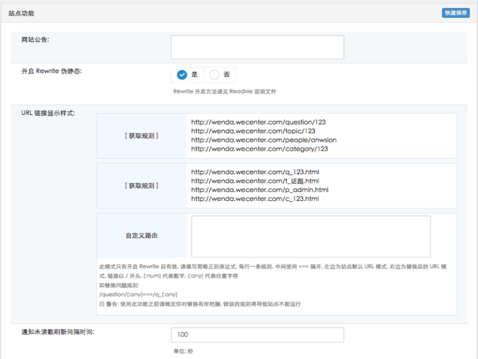

**网站公告**：在输入框内输入网站的公告内容，会在网站首页侧边栏显示。

**开启 Rewrite伪静态**：“是”，表示网站已开启 Rewrite 伪静态功能。
“否”，表示网站未开启Rewrite伪静态功能。Rewrite 开启方法请见 ReadMe 说明文件或去官方社区查看相关教程。

**URL链接显示样式**：在开启 Rewrite 伪静态的前提下，WeCenter 程序关于 URL 伪静态链接样式提供了三种选择，如下图：

其中自定义模式只有开启 Rewrite 后有效，官方提供两种url规则，并提供自定义规则输入框，如需要自定义规则，请填写简略正则表达式，每行一条规则，中间使用===隔开，左边为站点默认 URL 模式，右边为替换后的 URL 模式，链接以 / 开头，(:num) 代表数字，(:any) 代表任意字符。
如替换问题规则与分类规则：

	/question/(:any)===/q_(:any)
	/home/explore/category-(:num)===/category/(:num)
将发现替换到首页:

	/home/explore/===/
(!) 警告：使用此功能之前请确定你对替换有所把握，错误的规则将导致站点不能运行。

**通知未读刷新间隔时间**：即未读的通知、私信刷新频率。时间可以根据服务器配置设置，越短时间对服务器的负担越重。

**问题自动锁定时间**：设置问题自动锁定时间即问题发布后自动锁定前的时间范围，问题锁定后，用户无法修改。

**网站统计代码**：即置于每个页面底部的JS代码，用于统计网站来源、在线页面等。管理员可使用CNZZ、Google、百度等的统计代码。

**问题举报理由选项**：该项功能只针对问题举报，不针对回复，举报理由管理员可以自己先填好，到时候让用户自己选择。举报功能利于网站运营管理过程中，引导用户自觉参与社区维护，保证内容免受垃圾信息干扰。用户认为某个问题违规，可以在该问题当前页，在该问题内容的右下方点击【举报问题】按钮，选择举报理由后补充说明后，提交即可。

**有新举报与认证申请私信提醒用户 ID**：即有新举报或者认证信息时，系统发私信提醒管理员用户 ID 帐号；WeCenter 程序安装时默认新举报信息提醒用户ID为1。

**系统时间格式**：网站所有内容信息动态时间的呈现格式，WeCenter 程序提供2种时间格式，即xx分钟前形式（例：5分钟前）和完整形式（例：2014-10-17 14:58）。

**管理员后台登录是否需要验证码**：“是”，表示网站后台登录需要输入验证码。“否”，表示网站后台登录不需要输入验证码。

**发送诊断数据帮助改善产品**：“是”，表示同意发送意见反馈帮助 WeCenter 改进改程序，“否”，反之。

####4. 内容设置

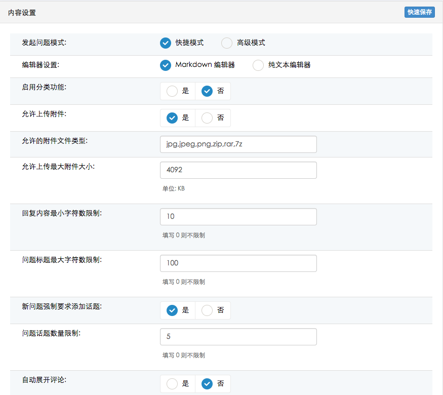

**发起问题模式**：即网站用户发起问题的规格，如标题、分类、话题等。WeCenter 程序提供2种发起问题的模式，一个是发起模式，另一个是高级模式。

- 快捷模式：网站开启了快速发起的问题模式，即包括问题的标题、补充、分类三个元素，并以浮动框的形式呈现，如下图：

- 高级模式：网站未开启快速发起的问题模式，它包括除了快捷模式之外附件和话题两个元素，显示模式为静态，如下图：

**编辑器设置**：WeCenter 提供了两种编辑器书写格式，一种是支持 Markdown 格式，一种是纯文本格式的。两种格式随意选择。

**启用分类功能**：“是”，表示开启分类，开启之后用户发起问题或文章都要选择分类。“否”，表示不开启此功能。

**允许上传附件**：“是”，表示允许上传附件，选择之后在发起问题或者文章时可以添加附件。“否”，表示不允许上传附件。

**允许的附件文件类型**：即允许用户上传附件的文件类型设置，用户只能上传允许的文件格式，其它不在允许范围内的则被系统禁止。

**允许上传最大附件大小（单位：KB）**：即用户上传附件包括图片等文件的最大容量限制，在设定的范围内允许用户上传附件操作。

**回复内容最小字符数限制**：即用户回答问题时，回复内容字符数最少不低于X个。比如回复字符数下限为10个，汉字为5个。如果是0，则表示字数不限。

**问题标题最大字符数限制**：即用户发起问题时，标题输入字符数最多不超过X个。比如标题字符数上限为50个，汉字为25个。如果是0，则表示字数不限。

**新问题强制要求添加话题**：“是”，表示用户每次发起问题时都必须选择或添加一个合适的话题。“否”，则没这个限制，用户可以不添加话题也能发起问题。

**问题话题数量限制**：每个问题最多能够被添加话题的数量。如果是0，则表示数量不限。

**自动展开评论**：

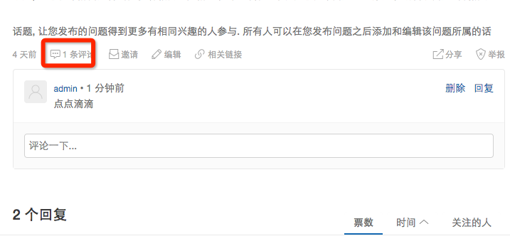

“是”，表示打开某个问题页面的时候，自动展开问题下面的评论(不是下面的回复)。

**评论内容最大字符数限制**：对评论内容的字数限制，一个汉字为两个字符数，填写0则不限制。

**话题标题最大字符数限制**：对话题字数的限制，一个汉字为两个字符数，填写0则不限制。

**允许上传最大头像/话题图片大小(单位：Kb)**：即用户上传头像、话题的图片最大容量限制，在设定范围内允许用户上传图片操作。

**回复编辑/删除有效时间（单位：分钟)**：即允许用户对自己已回复的内容进行编辑/删除操作的有效时间。当超过设定的有效时间后，用户不能再对发表过的回复进行编辑/删除的操作。

**“没有帮助“数量达到多少个时折叠回复**：即用户的回复对提问主题没有参考价值或者灌水被X个用户标记“没有帮助”后，答案将被折叠。

**系统自动选出最佳回复时间**：管理员可以设置每个问题的最佳回复，如果有些问题管理员忘了设置最佳答案则可以利用程序这个自带的功能。最佳回复针对每个问题而言，凡是达到条件系统自动产生。这里是最佳回复产生所需的时间（周期），以天为单位。最佳回复产生后，暂时不会因为投票数的改变而改变。

**参与自动选出最佳回复的问题最小回复数**：最佳回复产生的条件之一，参与最佳回复自动产生的问题必须达到的最少回复数。比如设定为5，表示该网站每个问题必须有至少5个回复方能成为最佳回复评选的条件之一。

**参与自动选出最佳回复的最小赞同数**：最佳回复产生的另一个条件，在某个问题最少回复量达到条件的前提下，某一回复成为最佳回复必须获得的最少赞同数。比如设定为3，当该问题回复数已超过5个，其中某个回复获得至少3个赞同数时，该回复自动评选为最佳回复。

**阅读器获取最近多少天的热门问题**：/reader取值的时间参数，设置365，则是从当前日期倒推最近一年的数据。

**阅读器热门问题赞同数需大于或等于**：/reader取值的回复赞同参数，设置5，则是取回复赞同数大于5的回复进入reader列表。

**自动建立地区/职业/公司话题**：“是”，表示开启后网站会自动建立这几个相关的话题。”否”，反之。

**敏感词列表**：把你希望在网站列为敏感词的词语写在里面，这样在网站内容里出现的敏感词将被替换成* 。

####5.威望积分

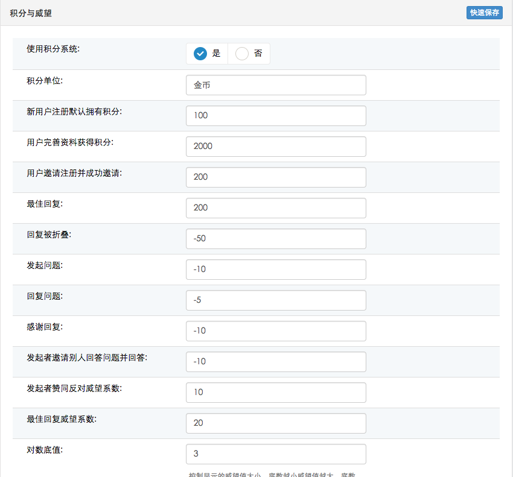

积分和威望是用来衡量用户参与度和贡献值的一项系统功能。积分的组成包括注册、完善资料、邀请、回复、提问及各项扩展积分。当设置完各项后，点击保存即可。

**使用积分系统**：“是”，表示系统开启积分系统，用户在发帖回帖已经感谢分享等动作，都能和积分挂钩。“否”，表示系统不开启积分系统。

**积分单位**：默认是金币，运行站长自己定义自己网站的积分单位，比如积分，金币，贝等。

**新用户注册默认拥有积分**：即用户注册成功系统赠送的积分数。

**用户完善资料获得积分**：即用户注册后完善个人资料可获系统赠送的积分数。这里的资料包括用户头像，用户资料，用户详细信息等内容。

**用户邀请注册并成功邀请**：即用户邀请站外用户注册成功后可获系统赠送的积分数。

**最佳回复**：即按系统规定符合条件产生的最佳回复可获系统赠送的积分数，该积分赠送给最佳回复获得者。

**回复被折叠**：即用户的回复被系统折叠，该用户需被扣除的积分数，用负数设置。

**发起问题**：即用户在网站发起问题需扣除的积分数，用负数设置。

**回复问题**：即用户回复问题时需扣除的积分数。扣除的积分转移到问题发起者，每增加一个回复发起者获得对应积分的奖励。

**感谢回复**：即用户感谢别人的回复时需扣除的积分数，对应扣除的积分转移给被感谢用户。

**发起者邀请别人回答问题并回答**：即用户邀请（站内外）其它用户回答问题且受邀者已回答问题后需被扣除的积分数。

**发起者赞同反对威望系数**：即发起者点击赞同答案或反对答案系数。
威望公式：log((((用户组威望系数x赞同数量-用户组威望系数x反对数量) + 发起者赞同反对威望系数 + 最佳回复威望系数) + 0.5), 对数底值)。

**最佳回复威望系数**：即用户最佳答案系数。

**对数底值**：控制显示的威望值大小，底数越小威望值越大，底数越大威望值越小，系统默认数值是3)。用户威望即个人威望的统计功能。

- 1．每个回复的威望值：以3为底X的对数，X=Sum（用户组威望系数x赞同数量-用户组威望系数x反对数量）+发起者赞同反对系数+最佳答案系数+0.5。
- 2、用户的威望值=Sum回复数的威望值，被折叠的回复不计算威望。

####6.用户权限

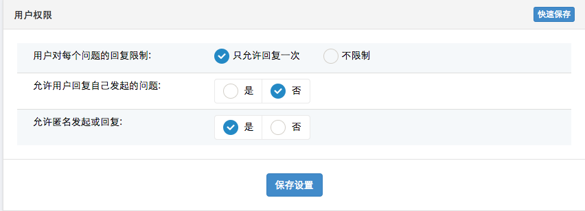

 用户权限功能设置包括网站用户回复限制、是否自问自答、是否匿名等。在设置完各项内容后，点击【保存】完成。
 
 **用户对每个问题的回复限制**：若选择用户对每个问题的回复限制为“只允许回复一次”，表示用户对每个问题的回复次数受限制，并只能一问一答；若选择“不限制”，则表示用户对每个问题的回复次数不受限制，可以一问多答。

**允许用户回复自己发起的问题**：“是”，表示用户可以回复自己发起的问题。
“否”，表示用户不能回复自己发起的问题。

**允许匿名发起或回复**：“是”，表示允许用户以匿名的方式发起问题或回答问题。
“否”，表示禁止用户以匿名的方式发起问题或回答问题。

####7.邮件设置

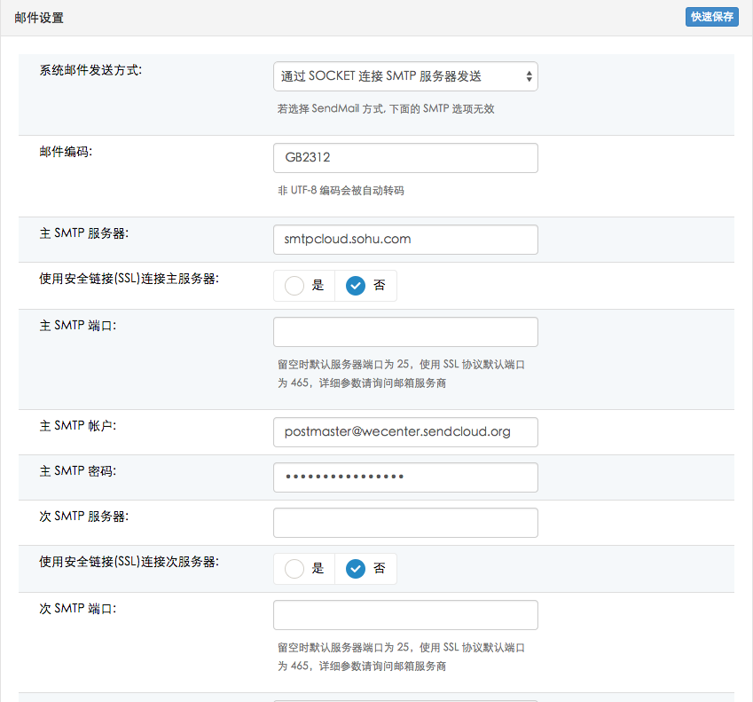

邮件设置通过安装相应协议的服务器进行邮件发送操作。这里邮件设置包括系统邮件发送方式、接收测试邮箱地址、SMTP服务器等。

**系统邮件发送方式**：该程序邮件发送方式提供“通过SOCKET链接SMTP服务器发送”和“通过PHP函数的sendmail发送”两种。管理者根据网站需求选择合适的发送方式。

**邮件编码**：设置邮件的编码方式，默认的编码方式为 UTF-8。

**主 SMTP 服务器**：邮箱的SMTP地址。如: smtp.gmail.com 或 smtp.qq.com。

**使用安全链接(SSL)连接主服务器**：此项需要服务器环境支持SSL，如果使用Gmail或QQ邮箱，请选择“是”，如果不使用选择“否”。

**主 SMTP 端口**：SMTP端口默认为25。使用SSL协议（Gmail或QQ邮箱）默认端口为465，详细参数请询问邮箱服务商的设置说明。

**主 SMTP 账户**：填写您申请的邮箱账户。

**主 SMTP 密码**：填写您申请的邮箱密码。

**次 SMTP 端口**：SMTP端口默认为25。使用SSL协议（Gmail或QQ邮箱）默认端口为465，详细参数请询问邮箱服务商的设置说明。

**次 SMTP 账户**：填写您申请的邮箱账户。

**次 SMTP 密码**：填写您申请的邮箱密码。

**系统邮件来源邮箱地址**：即用户接收邮件的系统发送地址。

####8.开放平台

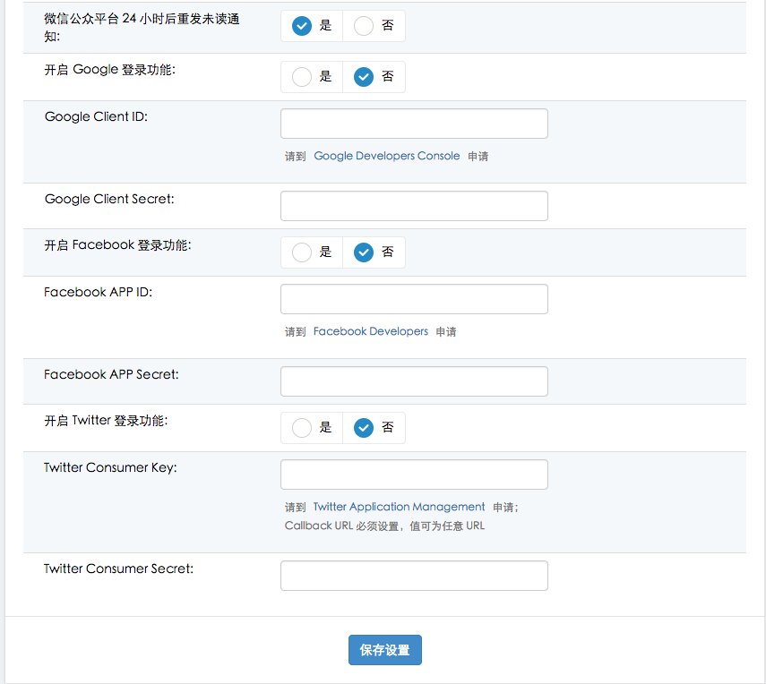

 WeCenter 程序可接入第三方帐号，需要用户去各平台申请属于自己的key和密钥。默认已做好的有新浪微博、腾讯QQ登录、微信公众平台的接口。
 
 **开启 QQ 登录功能**：“是”，表示网站提供QQ登录接口，用户可以用QQ直接登录网站。
“否”，表示网站不提供QQ登录接口，用户不能用QQ直接登录网站。

**QQ 登录AppId**：如果开启了QQ登录功能，那么QQ登录的AppID需要到QQ互联开放平台申请（注意：请申请网站，不要申请应用）。

**QQ 登录Appkey**：如果开启了QQ登录功能，那么QQ登录的AppKey需要到QQ互联开放平台申请（注意：请申请网站，不要申请应用）。

**开启新浪微博登录功能**：“是”，表示网站提供新浪微博登录接口，用户可以用新浪微博直接登录网站。“否”，表示网站不提供腾讯微博登录接口，用户不能用新浪微博直接登录网站。

**新浪微博 AppKey(akey)**：如果开启了新浪微博登录功能，那么新浪微博的AppKey需要到新浪微博开放平台申请（注意：请申请网站，不要申请应用）。

**新浪微博 AppKey(skey)**：如果开启了新浪微博登录功能，那么新浪微博的AppKey需要到新浪微博开放平台申请（注意：请申请网站，不要申请应用）。

**微信公众平台接口 Token**：对应的数值只需要和微信公众平台开发者模式里面对应的Token值一致，可随意输入，建议使用16-32位的字符串。

**微信公众平台帐号角色**：WeCenter 提供四个角色选择，分别是“普通订阅号”、“微信认证订阅号”、“普通服务号”、“微信认证服务号”。

**微信公众平台 AppID**：这个只有微信服务号才有，登录微信公众平台网页获取 AppID。

**微信公众平台 AppSecret**：这个只有微信服务号才有，登录微信公众平台网页版获取AppSecret。

**WeCenter 微信服务 Access token**：Wecenter微信服务的Access token和secret用来连接 mp.wecenter.com 获取服务号菜单设置权限认证和其他辅助功能（比如活动系统，签到系统，以及表单系统），这两个参数要在mp.wecenter.com后台获取并填写保存。

**WeCenter 微信服务 Access secret**：Wecenter微信服务的Access token和secret用来连接mp.wecenter.com获取服务号菜单设置权限认证和其他辅助功能（比如活动系统，签到系统，以及表单系统），这两个参数要在mp.wecenter.com后台获取并填写保存。

关于WeCenter 微信公众平台的使用教程可以参考：http://wenda.wecenter.com/article/63

**微信公众平台 24 小时后重发未读通知**："是"，表示在24小时内公众帐号将向那些没读推送消息的读者发送通知。

**开启 google 登录**：这个和下面的 twitter 和 facebook 第三方登录是方便国外用户的需求，如果你的网站面向国外的用户，则可以到对应的站点申请 key和 Secret，对应填写后便可开启第三方登录。

####9.性能优化

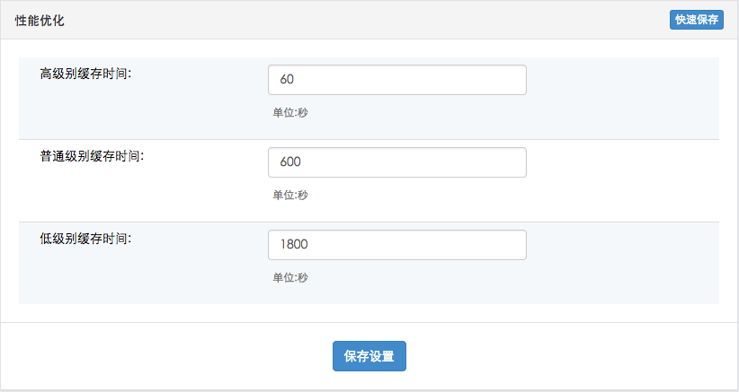

系统内置缓存参数调整，保存默认情况既可，不要轻易调整。

####10.界面设置

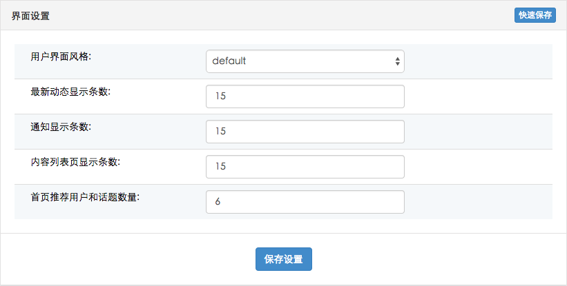

 界面设置即关于网站的模板风格、内容列表等相关的设置。包括网站界面风格、分类显示模式、内容列表分页数等。

**用户界面风格**：管理员可以在这里选择网站的模板风格，默认的是 default风格，管理员可以新建模板风格然后在这里选择应用。

**最新动态显示条数**：即形成“首页最新动态”页面每页浏览的内容列表条数，如内容列表分页数为15，表示用户能浏览15条/页，鼠标每点击一次“更多”按钮，加载一个15条内容的“新首页最新动态”页面。

**通知显示条数**：即形成“通知”页面分页浏览的内容列表条数，如内容列表分页数为15，表示用户能浏览15条/页，鼠标每点击一次“更多”按钮，加载一个15条内容的“新通知”页面。

**内容列表页显示条数**：即形成“问题和用户列表”页面分页浏览的内容列表条数，如内容列表分页数为15，表示用户能浏览15条/页，鼠标每点击一次“更多”按钮，加载一个15条内容的 “新问题、发现、个人主页”页面。

**首页推荐用户和话题数量**：首页右下角可能感兴趣的人或话题显示的数量，偶数配置。

###三.内容管理

####1.问题管理

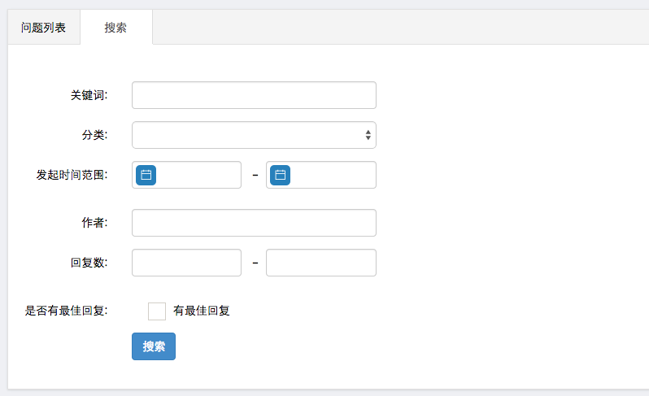

问题列表显示的内容为网站的所有问题，管理人员可以在后台这里删除或编辑这些问题。
还可以通过切换到搜索栏目通过搜索关键字等来搜索你想要的问题。

####2.文章管理

文章列表显示的内容为网站的所有文章，管理人员可以在后台这里删除或编辑这些文章。
还可以通过切换到搜索栏目通过搜索关键字等来搜索你想要的文章。

####3.话题管理

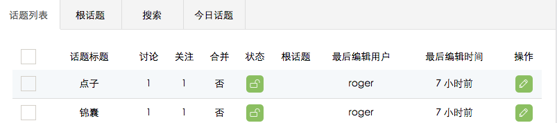

话题管理分四个 Tab 功能切换按钮：话题列表、根话题、搜索、今日话题。

**话题列表**：其中话题列表显示的是网站所有的话题，管理人员可以在话题列表进行删除，编辑话题等操作。

点击每个话题后面的那个绿色编辑按钮可以进入话题编辑页面：

**根话题**：

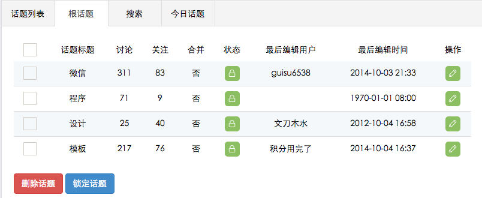
根话题下面显示的网站的所有根话题，管理员可以在这里管理网站的根话题，如果网站没有设置根话题则不显示内容。

**搜索**：通过关键字来搜索你想要的话题

**今日话题**：

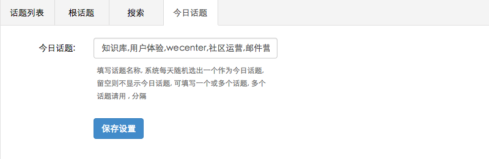

可以填写话题名称, 系统每天随机选出一个作为今日话题, 留空则不显示今日话题, 可填写一个或多个话题, 多个话题请用 , 分隔。最终是显示在话题页面的侧边栏。

###四. 用户管理

####1.用户列表

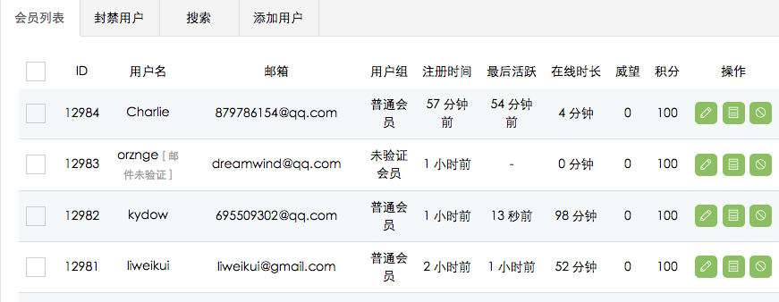

**会员列表**：显示网站的所有用户，管理人员可以在这里删除，封禁，编辑用户相关资料等。

**封禁用户**：

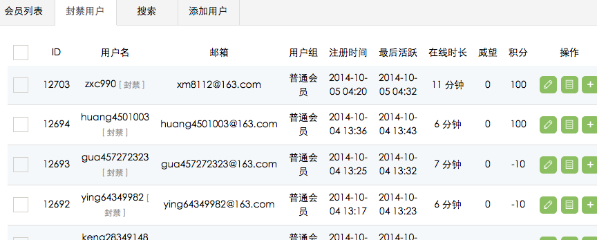

显示网站已有的封禁用户，管理员在这里管理这些封禁用户，没有封禁用户则不显示内容。

**搜索**：通过用户名，邮箱等有关资料来搜索某个用户。

**添加用户**：

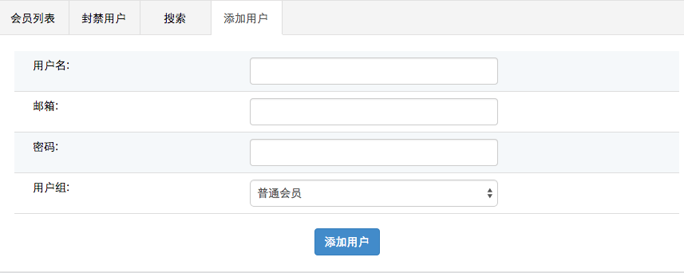

管理员可以直接在后台这里通过添加用户名，用户邮箱，用户密码直接添加网站会员。

####2.用户组

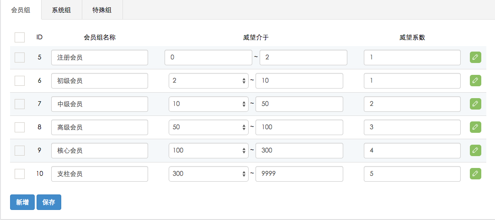

用户组目前分为普通会员组、系统组、特殊组。

**会员组**：会员组由系统组中的普通会员细分而来，管理员根据自己网站的需求通过设置威望数可以添加各种细分的组，比如 WeCenter 设置的会员组有注册会员、初级会员、中级会员、高级会员、核心会员。然后设置好组后没可以通过后面绿色的编辑按钮设置这个组的权限。

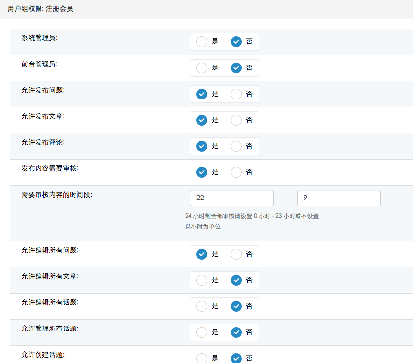

**系统组**：

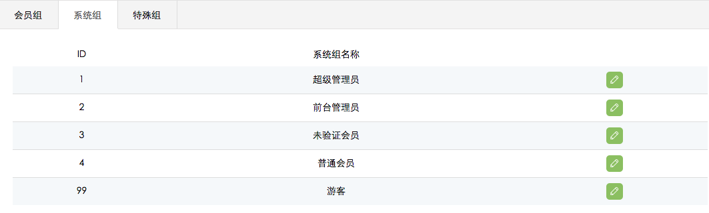

系统组表示的是网站已经默认的分组，包含所有来访网站人员的身份。包括超级管理员、前台管理员、未验证会员、普通会员、游客，可以对每个分类进行权限编辑。比如点击游客分组后面绿色的权限编辑按钮可以对游客的权限进行编辑：

**特殊组**：
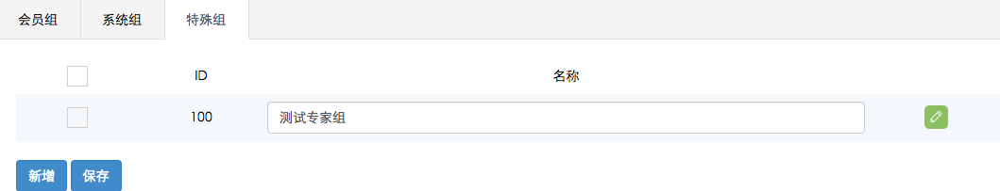

特殊组表示的是网站管理员根据自己网站的需求添加一些特殊的分组，比如你要给你的网站添加一个测试小组，可以通过新增按钮添加测试小组，然后根据自己的需求给这个小组设置权限。

####3.批量邀请

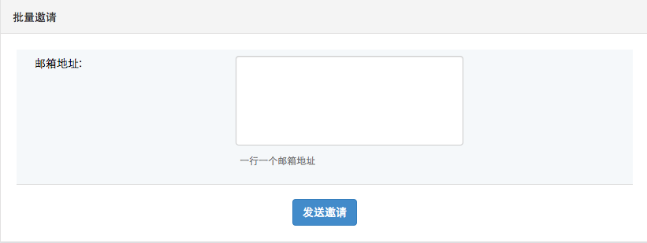

即手动直接添加多个受邀用户的邮箱，每行输入一个邮箱地址，并点击【发送邀请】完成。受邀的用户通过邮箱里的邀请链接点击，进入网站的注册界面。

####4.职位设置

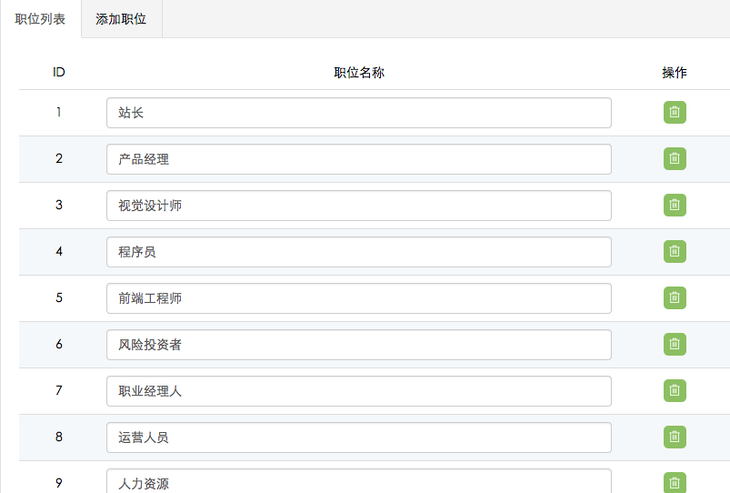

管理员可以根据自己网站所处的行业添加一些具体的职位，让用户注册的时候选择自己的职位。
一开始职位列表显示的是程序默认设置的职位，管理员可以点击后面的删除按钮删除这些职位或者直接在输入框里修改自己想要的职位，也可以通过添加职位添加更多的职位。

###五. 审核管理

####1. 内容审核

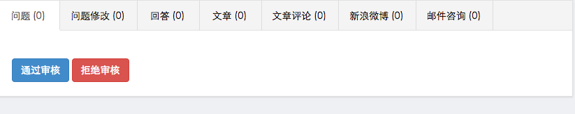

如果你设置了有需要审核后才能发布的内容，这里将显示的是网站所有需要审核的内容，比如设置了刚注册用户发布第一个问题需要审核，那么这里的问题栏将会显示这个要审核的问题。其余的几个回答、文章栏目都是如此。

####2. 认证审核

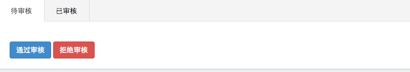

WeCenter 提供了用户认证机制，如果有用户申请了认证，这里的待审核栏目将会显示那些申请认证的用户列表，通过审核的用户会显示在已审核的栏目列表。

####3. 注册审核

如果在之前全局设置了开启了新用户注册需要后台审核，那么这里将会显示等待审核的注册用户，管理员也可以有自己的理由拒绝通过审核。

####4. 用户举报

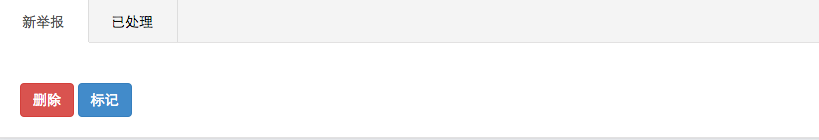

这里显示的是网站用户在前台举报的问题，点击 标记按钮 举报的问题会自动分到已处理这个栏目。也可以点击删除把这些举报的问题删除掉。

###六. 内容设置

内容设置包含网站的导航、分类、专题、页面等设置功能。

####1. 导航设置

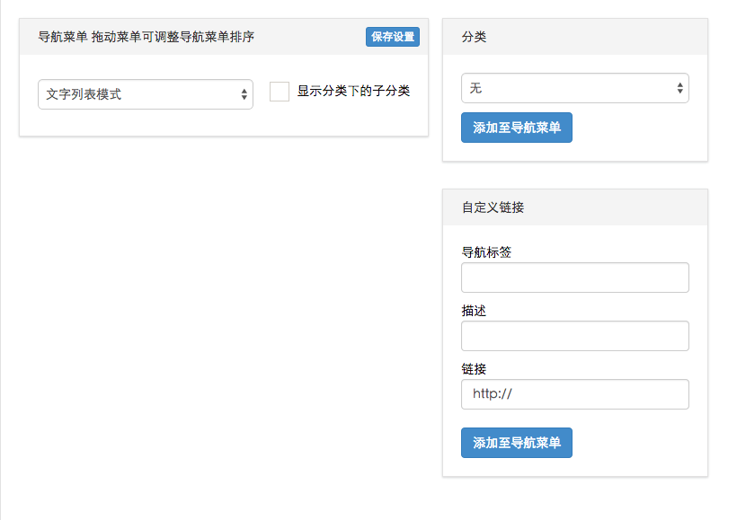

导航栏默认会显示在发现页面和文章页面的头部菜单栏下面。导航栏主要显示的是网站分类，也可以自定义链接添加到导航栏，导航栏分图标模式和纯文字列表模式两个显示方式，各个分类之间可以通过拖拽来排序。有的分类下面可能还有子分类，也可以通过“显示分类下的子分类”来设置是否需要显示子分类目录。

####2. 分类管理

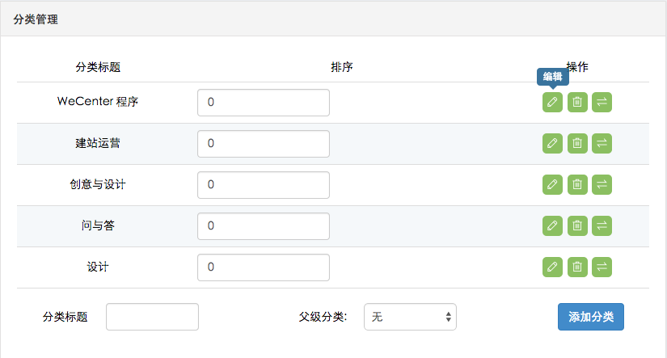

(分类目录列表)

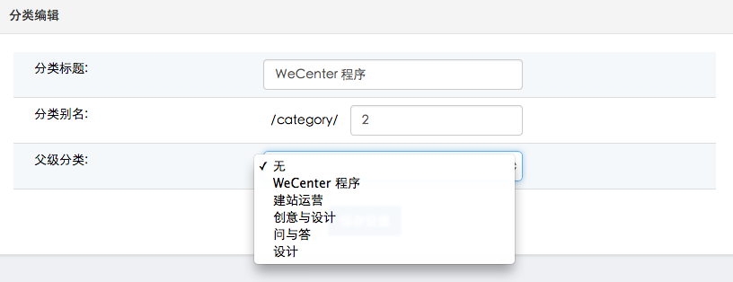

(编辑分类)

前面全局设置里的内容设置里可以设置是否开启分类功能，如果开启了，管理员可以在这里添加网站需要的分类，通过设置分类标题，是否有父级分类，以及填写排序来添加一个新分类。

####3. 专题管理

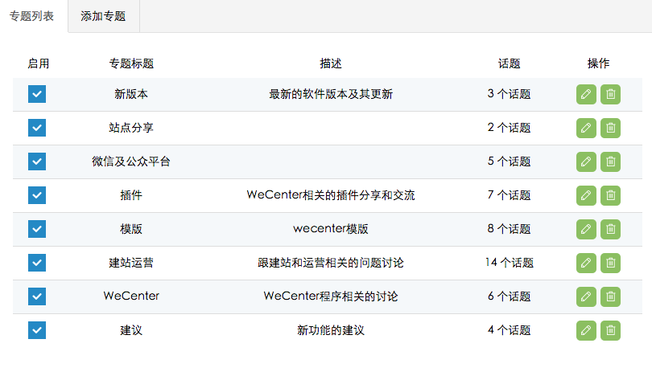

(专题列表)

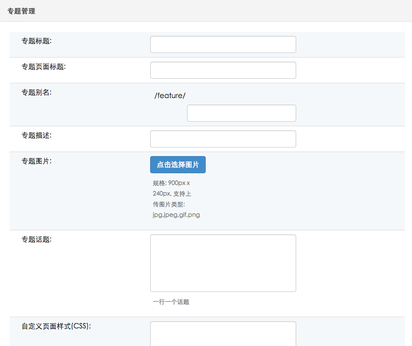

(编辑专题)

专题列表显示网站的所有专题，管理员可以删除和编辑专题。如果没有专题可以切换到 添加专题 栏目手动添加专题，专题页面可以自己自定义页面css，添加专题相关的话题等

####4. 页面管理

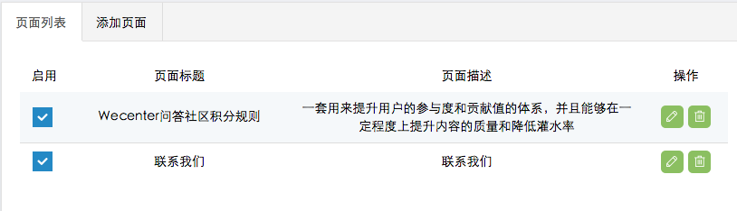

(页面列表)

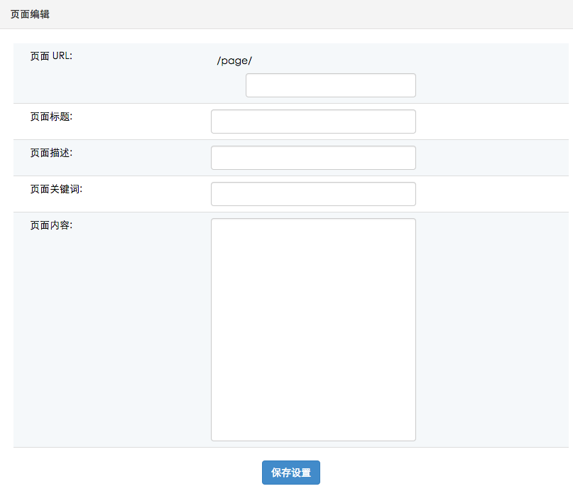

(添加页面)

WeCenter 提供自定义页面的功能，有什么内容需要单独一个页面来显示的可以在这里添加一个页面来制作，比如关于、服务等页面。添加页面只要填写你的页面地址、页面标题、页面描述、页面关键字、页面内容等。其中页面内容支持 HTML 和 CSS ，可以完全实现一个单独页面和网站结构不一样。

####5. 帮助中心

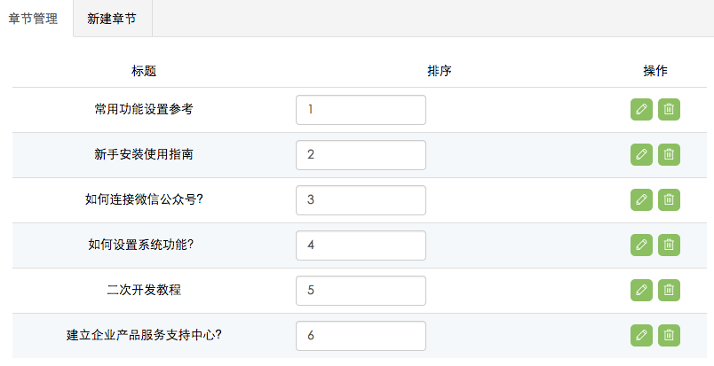

(帮助中心章节分类列表)

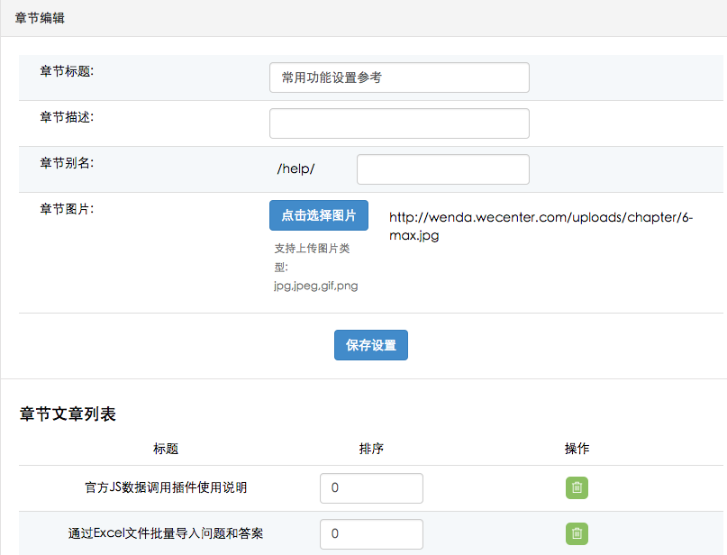

(编辑帮助中心的章节分类)

帮助中心是 WeCenter 提供的一个帮助系统。这里的章节管理表示的是分章节管理帮助中心的文章，管理员可以修改数字排序，删除和编辑章节，和分类有点点类似。通过新建章节可以给帮助中心添加新的章节来管理文章。帮助中心的文章都是通过问题和文章页面的“添加到帮助中心”添加进来的，添加的时候会让你选择合适的章节。

###七. 微信微博

对微信微博第三方开放平台的功能管理。

以下微信的功能仅对认证了的服务号有效，没有认证的服务号无须设置此功能，对应的开放平台设置可以参考前面“全局设置“里的开放平台设置。

####1. 微信多帐号管理

通过新增帐号添加新的公众帐号，对应填写的资料和“全局设置“里的开放平台里的微信设置一样。

####2. 微信菜单管理

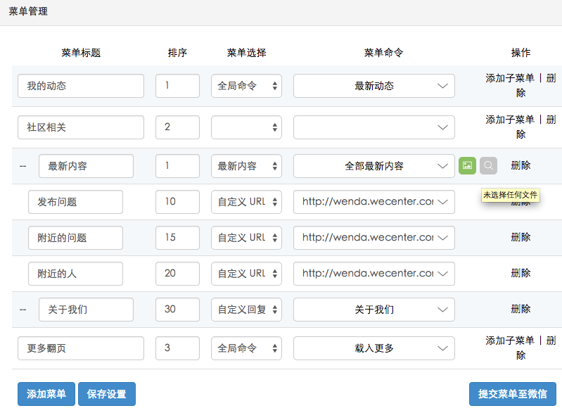

这里的设置对应的是微信公众号在微信里的底部菜单，最多可以创建三个菜单。菜单标题填写你要在微信端展示的菜单栏目，可以设置子菜单。通过修改排序下面的数字可以改变它们在菜单栏里排列顺序。

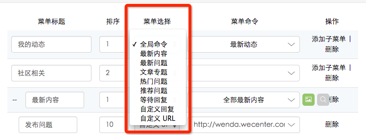

设置好菜单标题后，每个菜单标题都会有对应的内容，这些内容就是通过“菜单选择和菜单命令“来设置的。菜单选择栏目里可以选择的菜单有全局命名、最新内容、最新问题、文章专题、自定义回复、自定义 URL 等，选择每个不同的菜单，后面菜单命令里就设置相应不同的内容。比如选择“全局命令“对应的菜单命令有最新动态、最新通知、我的提问、载入更多；如果选择了自定义URL，则在菜单命令栏出填写你的 URL；如果选择了自定义回复，则在菜单命令栏处选择你要自定义回复的内容，自定义回复的内容可以下面的“微信自定义回复”设置。

设置好后，保存设置，提交菜单至微信。

####3. 微信自定义回复

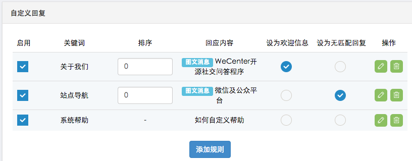

(自定义回复列表)

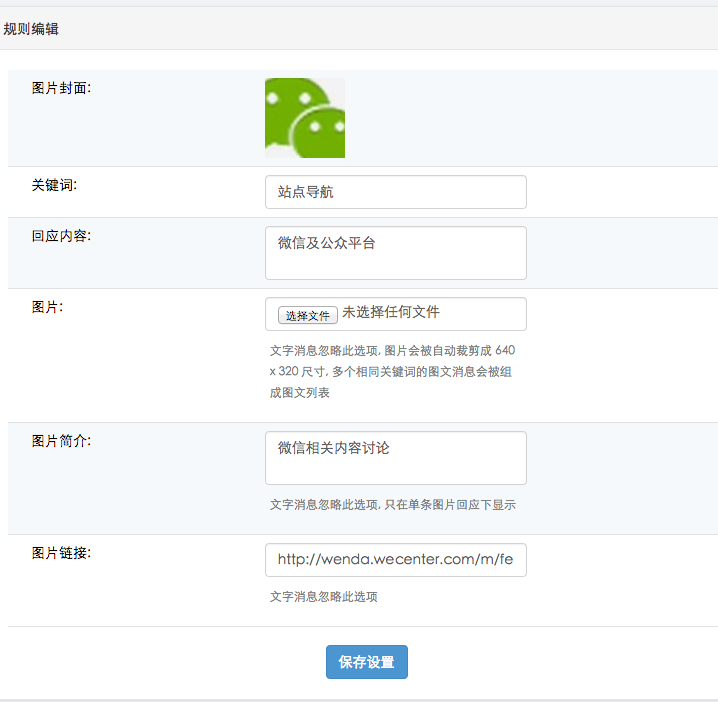

(编辑自定义回复内容)

设置微信自定义回复的内容，设置好后可以在上面微信菜单管理处调用。每条自定义回复内容都可删除和编辑，也可以修改它们的排列顺序。如需添加自定义回复内容则点击下面的 添加规则 ,进入对应的规则编辑页面，填写对应的内容就可以，如果有图片注意图片的大小要合适最好是640x320的，写完保存之后，再回到前面点击启用下面那个按钮，这样自定义回复就设置好了。

####4. 微信第三方接入

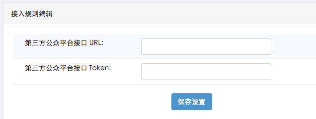

填写对应的第三方接口 URL和 Token 就可以，这个第三方应该都有提供。

####5. 微信二维码管理

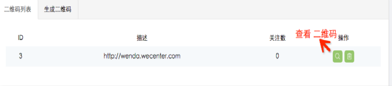

生成二维码功能就是直接在描述里填入你扫描二维码后要显示的内容，可以是链接等。填完之后点击生成即生成了一个二维码，在二维码列表可以管理你生成的所有二维码。点击操作栏目下面的放大镜按钮可以马上查看生成的二维码，也可点击删除按钮删掉这个二维码。

####6. 微信消息群发

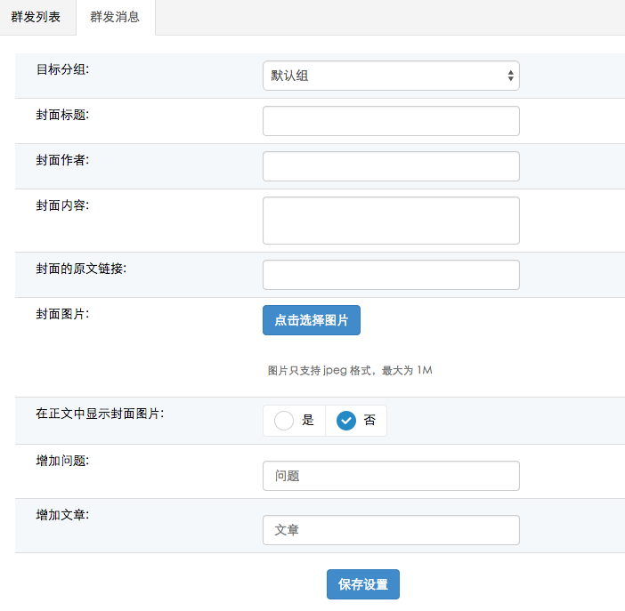

管理员可以在这里设置在微信上群发的消息内容。可以通过目标分组选择要群发消息的分组，然后对应填写相关的内容保存即可生成一条群发消息，群发的消息可以是问题，也可以是文章，只要在下面“增加问题“”增加文章”输入你想要群发文章相关的关键字就会查找出对应的文章或问题。
然后所有的群发消息都会显示在群发列表，你可以在此查看，但是不能再编辑。

####7. 微博消息接收

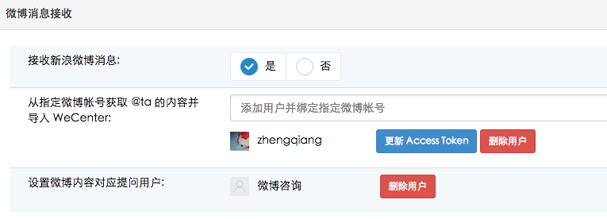

可以选择是否接受新浪微博消息，在“从指定微博帐号获取@ta 的内容并导入WeCenter”旁边的输入框输入用户名，当然输入的用户名要在网站上绑定了新浪微博。
“设置微博内容对应提问用户”管理员可以单独设置一个用户作为用来管理来自微博有关的内容。

####8. 邮件导入

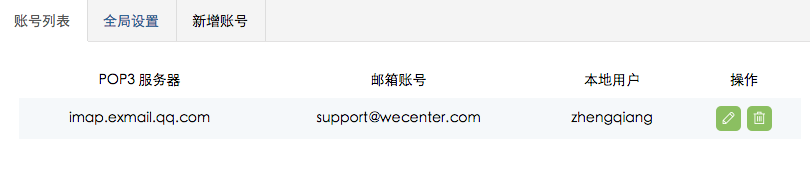

(邮件导入帐号列表)

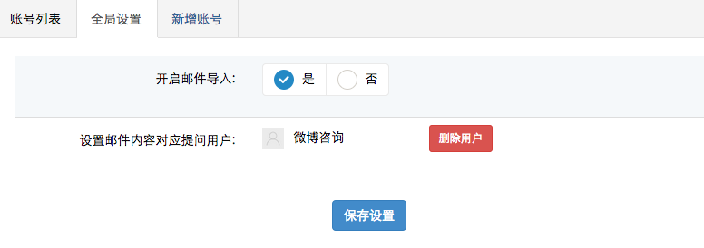

(邮件导入帐号设置)

###八. 邮件群发功能

####1. 任务管理

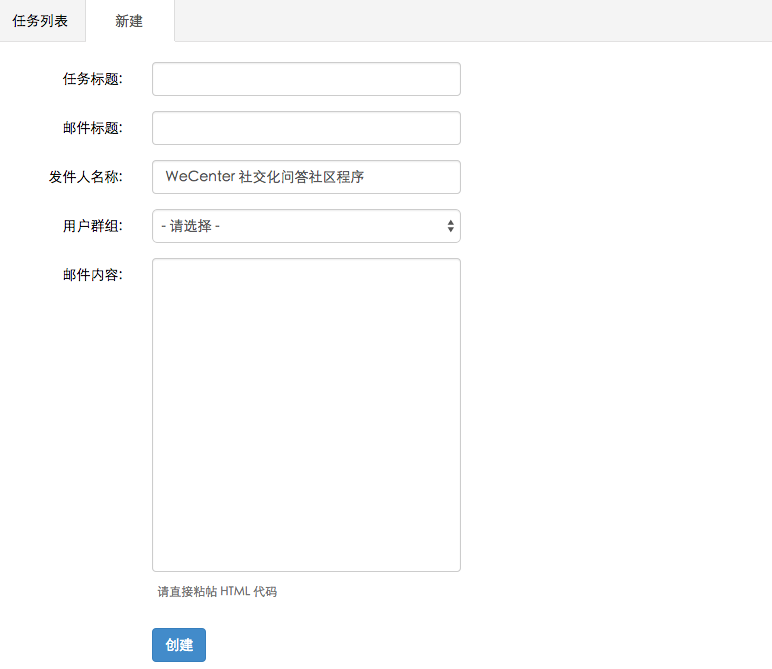

WeCenter 支持邮件群发功能，只要在这里设置右键群发的内容以及选择接受邮件的用户群组(用户群主在下面创建)等内容就可以创建一封群发的邮件了。

####2. 用户群管理

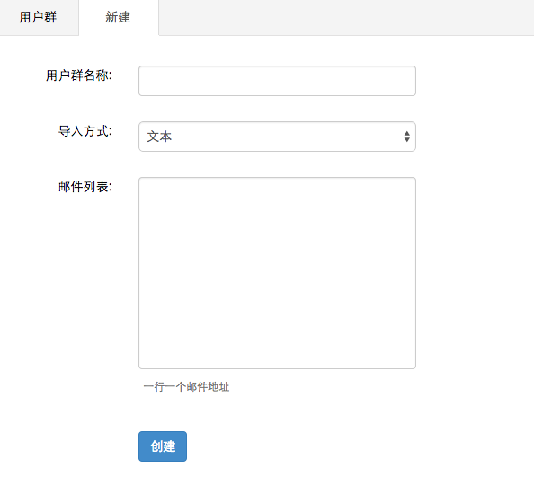

上面创建群发邮件一定要选择接收的用户群租，这里就可以创建管理用户群组。可以自定义用户群组名称，用户群成员可以导入系统自带的用户组，也可以选择文本方式，在下面的邮件列表填写用户的邮箱(一行一个邮件地址)。

###九. 工具

####1. 系统维护

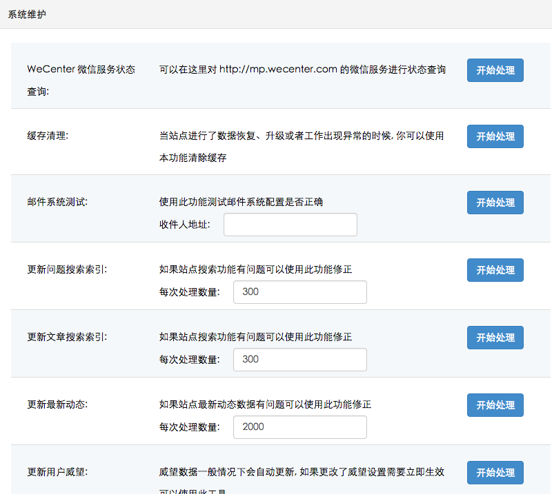

**WeCenter 微信服务状态查询**：如果微信服务有问题了，点击后面的开始处理按钮来查看什么问题。

**缓存清理**：当站点进行了数据恢复、升级或者工作出现异常的时候，你可以使用本功能重新生成缓存。更新缓存的时候，可能让服务器负载升高，请尽量避开会员访问的高峰时间。

**邮件测试系统**：使用此功能测试邮件系统配置是否正确。

**更新问题搜索索引**：如果站点搜索功能有问题可以使用此功能修正，每次处理的数量按默认的数字就好。

**更新文章搜索索引**：如果站点搜索功能有问题可以使用此功能修正。

**更新最新动态**：升级过程中可能产生最新动态数据的出错，可以试试这个操作命令。

**更新用户威望**：威望数据一般情况下会自动更新，如果更改了威望设置需要立即生效可以使用此工具。  根据你的服务器性能填写每次更新用户个数，若更新过程缓慢，请减少每次更新个数。

**更新话题统计**：话题统计数据一般情况下会自动更新, 如果需要使统计立即生效可以使用此工具。

**BBCode 转换**：如果您的社区是discuz,phpwind等BBcode编辑器产生的，需要转换一下BBcode 2 Markdown格式，这个命令帮助你自动转换对应的数据格式。 

**更新微信菜单**：此工具可以读取系统中的微信配置并提交给微信公众平台, 使用前请确认菜单已经配置好, 并且有菜单权限。

